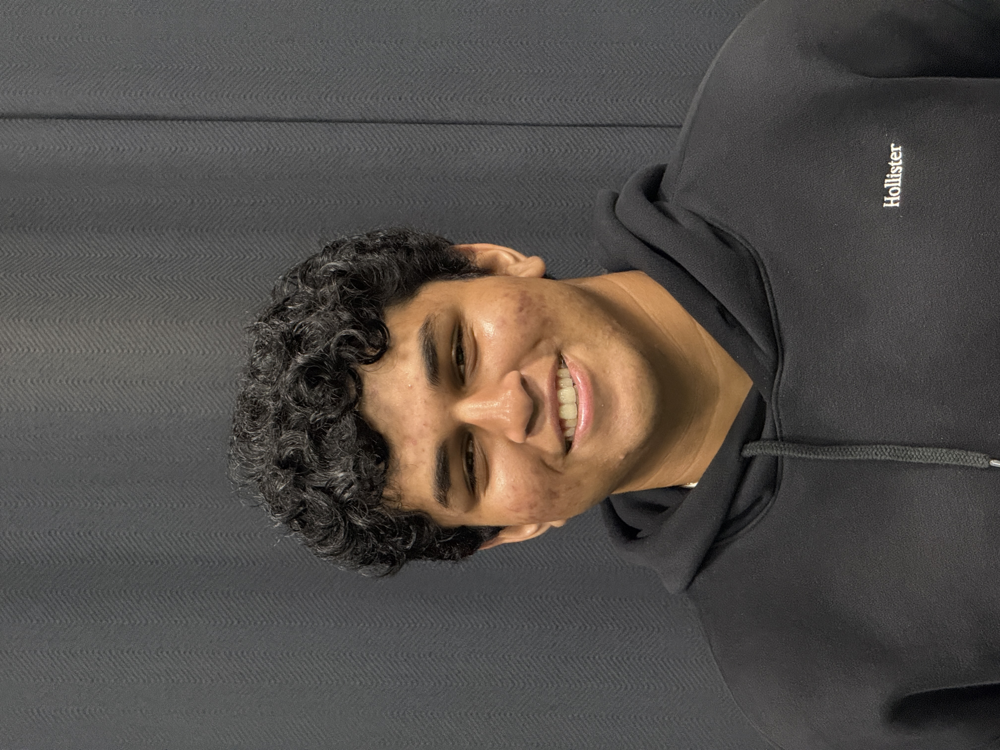

<!-- Main Content Area -->

  

    <h1>Keerthan Karumudi</h1>
    
Student at Del Norte High School | Aspiring Aerospace engineer | Electricity and Magnetism intern at UCSD | Pilot City intern | STEM Innovator | Robotics Enthusiast |

  

  

    <!-- Profile and Links Side-by-Side -->
    

      <!-- Profile Picture -->
      
<!-- Links Section -->
      

        <a class="link-card email" href="mailto:karumudikeerthan@gmail.com">
          <i class="fas fa-envelope"></i>
          

            <h4>Email</h4>
            
karumudikeerthan@gmail.com

          

        </a>
        <a class="link-card github" href="https://github.com/Githubneos">
          <i class="fab fa-github"></i>
          

            <h4>GitHub</h4>
            
github.com/Githubneos

          

        </a>
        <a class="link-card linkedin" href="https://www.linkedin.com/in/keerthan-karumudi-016699368/">
          <i class="fab fa-linkedin"></i>
          

            <h4>LinkedIn</h4>
            
linkedin.com/in/Keerthank

          

        </a>
        <a class="link-card resume" href="https://www.canva.com/design/DAGqMqKJxKQ/uIO9Cu6XeHyBzHG-_7Ageg/edit">
          <i class="fas fa-file-alt"></i>
          

            <h4>Resume</h4>
            
View my resume

          

        </a>
        <a class="link-card onshape" href="https://cad.onshape.com/documents?resourceType=resourceuserowner&nodeId=672eaeee5c1e190ae6501ec7">
          <i class="fas fa-cube"></i>
          

            <h4>Onshape</h4>
            
See my CAD work

          

        </a>
      

    

  

<!-- External FontAwesome -->
<link rel="stylesheet" href="https://cdnjs.cloudflare.com/ajax/libs/font-awesome/6.4.0/css/all.min.css">

<!-- Custom Styles -->

<!-- About Me Section -->

  <h2>About Me</h2>
  

    I focus on building practical, impactful solutions at the intersection of software, science, and education.
  

  <ul>
    <li><strong>Software Development:</strong> Built full-stack apps and backend systems at PilotCity and Open Coding Society.</li>
    <li><strong>Physics Research:</strong> Explored magnetized plasma interactions at UC San Diego.</li>
    <li><strong>Technical Design:</strong> Led Blender and Onshape projects as 3D Animation Club VP, teaching students advanced modeling.</li>
    <li><strong>STEM Education:</strong> Developed curriculum for aerospace-themed outreach programs for K–12 students through Project Flight.</li>
    <li><strong>Team Leadership:</strong> Served as Robot design and fabrication lead in FRC team Optix.</li>
    <li><strong>Mission-Driven:</strong> Dedicated to making engineering more accessible and inspiring curiosity through real-world projects.</li>
  </ul>

